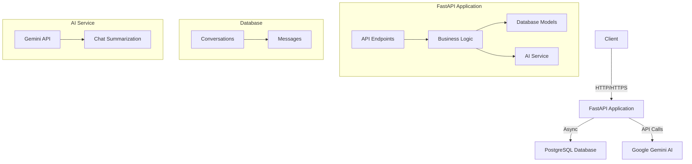

# SimplifyChat API

A FastAPI-based REST API for chat management and summarization using PostgreSQL and Google's Gemini AI. This project demonstrates a practical approach to building a scalable chat application with AI-powered features.

## Architecture



## Features

- Real-time chat message storage and retrieval
- Conversation management with participants
- Chat summarization using Gemini AI
- Pagination and filtering for chat history
- Docker support for easy deployment
- Async database operations for better performance
- JWT-based authentication (planned)

## Tech Stack

- **Backend Framework**: FastAPI
- **Database**: PostgreSQL with asyncpg
- **ORM**: SQLAlchemy (async)
- **AI Integration**: Google Gemini AI
- **Containerization**: Docker & Docker Compose
- **API Documentation**: OpenAPI (Swagger UI)
- **Database Migrations**: Alembic

## Quick Start

### Using Docker (Recommended)

1. Clone the repository:
```bash
git clone https://github.com/yourusername/simplifychat.git
cd simplifychat
```

2. Set up environment variables:
```bash
# Copy the example environment file
cp .env.example .env

# Edit .env with your configuration
# Only GEMINI_API_KEY is required when using Docker, as database configuration is handled by docker-compose
```

3. Build and run with Docker Compose:
```bash
# Build and start the services
docker-compose up --build

# To run in detached mode (background)
docker-compose up -d --build
```

The API will be available at `http://localhost:8000`

#### Docker Container Management

```bash
# Stop the containers
docker-compose down

# View container logs
docker-compose logs -f

# View logs for a specific service
docker-compose logs -f web  # For the FastAPI application
docker-compose logs -f db   # For the PostgreSQL database

# Rebuild a specific service
docker-compose up -d --build web

# Remove all containers and volumes (WARNING: This will delete all data)
docker-compose down -v
```

#### Database Management with Docker

The PostgreSQL database is automatically configured with:
- Database name: `simplifychat`
- Username: `simplifychat`
- Password: `simplifychat`
- Port: `5432` (mapped to host machine)

To access the database:
```bash
# Using docker exec
docker-compose exec db psql -U simplifychat -d simplifychat

# Using psql from host machine
psql -h localhost -U simplifychat -d simplifychat
```

Common database operations:
```bash
# View tables
\dt

# Describe a specific table
\d+ conversations
\d+ messages

# Basic queries
SELECT * FROM conversations;
SELECT * FROM messages;
```

### Local Development

1. Create a virtual environment:
```bash
python -m venv venv
source venv/bin/activate  # On Windows: venv\Scripts\activate
```

2. Install dependencies:
```bash
pip install -r requirements.txt
```

3. Set up environment variables:
```bash
# Copy the example environment file
cp .env.example .env

# Edit .env with your configuration
# Make sure to replace all placeholder values with your actual credentials
```

4. Set up the database:
```bash
# Create PostgreSQL database
createdb simplifychat

# Run migrations
alembic upgrade head
```

5. Run the application:
```bash
uvicorn backend.app.main:app --reload
```

## API Endpoints

### Conversations

- `POST /api/v1/chats` - Create a new conversation
- `GET /api/v1/chats/{conversation_id}` - Get a specific conversation
- `DELETE /api/v1/chats/{conversation_id}` - Delete a conversation
- `GET /api/v1/users/{user_id}/chats` - Get user's chat history with pagination and filtering

### Messages

- `POST /api/v1/chats/{conversation_id}/messages` - Add a message to a conversation

### Summarization

- `POST /api/v1/chats/{conversation_id}/summarize` - Generate a summary of the conversation

## Example Usage

### Create a Conversation

```bash
curl -X POST "http://localhost:8000/api/v1/chats" \
     -H "Content-Type: application/json" \
     -d '{
           "user_id": "user123",
           "participants": ["user123", "user456"],
           "title": "Project Discussion"
         }'
```

### Add a Message

```bash
curl -X POST "http://localhost:8000/api/v1/chats/{conversation_id}/messages" \
     -H "Content-Type: application/json" \
     -d '{
           "content": "Hello, how are you?",
           "sender": "user123"
         }'
```

### Get Conversation Summary

```bash
curl -X POST "http://localhost:8000/api/v1/chats/{conversation_id}/summarize"
```

## API Documentation

Once the application is running, you can access:
- Swagger UI: `http://localhost:8000/docs`
- ReDoc: `http://localhost:8000/redoc`

## Development

### Database Migrations

To create a new migration:
```bash
# With Docker
docker-compose exec web alembic revision --autogenerate -m "description"

# Local development
alembic revision --autogenerate -m "description"
```

To apply migrations:
```bash
# With Docker
docker-compose exec web alembic upgrade head

# Local development
alembic upgrade head
```

To check migration status:
```bash
# With Docker
docker-compose exec web alembic current
docker-compose exec web alembic history

# Local development
alembic current
alembic history
```

## Docker Setup

The project includes a Docker setup with the following services:

- FastAPI application
- PostgreSQL database
- pgAdmin (optional, for database management)

### Docker Compose Configuration

```yaml
version: '3.8'

services:
  web:
    build: .
    ports:
      - "8000:8000"
    environment:
      - DATABASE_URL=${DATABASE_URL}
      - GEMINI_API_KEY=${GEMINI_API_KEY}
      - SECRET_KEY=${SECRET_KEY}
      - ALGORITHM=${ALGORITHM}
      - ACCESS_TOKEN_EXPIRE_MINUTES=${ACCESS_TOKEN_EXPIRE_MINUTES}
    depends_on:
      - db
    volumes:
      - .:/app
    command: >
      sh -c "alembic upgrade head &&
             uvicorn backend.app.main:app --host 0.0.0.0 --port 8000 --reload"

  db:
    image: postgres:15
    volumes:
      - postgres_data:/var/lib/postgresql/data
    environment:
      - POSTGRES_USER=postgres
      - POSTGRES_PASSWORD=postgres
      - POSTGRES_DB=simplifychat
    ports:
      - "5432:5432"

volumes:
  postgres_data:
```

## Project Structure

```
simplifychat/
├── alembic/              # Database migrations
├── backend/
│   └── app/
│       ├── api/         # API endpoints
│       ├── core/        # Core configuration
│       ├── db/          # Database setup
│       ├── models/      # SQLAlchemy models
│       ├── schemas/     # Pydantic models
│       └── services/    # Business logic
├── docker/              # Docker configuration
├── tests/              # Test files
├── .env                # Environment variables
├── docker-compose.yml  # Docker Compose configuration
├── Dockerfile         # Dockerfile for the application
└── requirements.txt   # Python dependencies
```

## Development Approach

This project follows a pragmatic approach focusing on:

1. **Simplicity First**: Using straightforward, well-understood patterns and avoiding over-engineering
2. **Async by Default**: Leveraging Python's async capabilities for better performance
3. **Type Safety**: Using Pydantic models and type hints for better code quality
4. **Documentation**: Comprehensive documentation with examples and diagrams
5. **Containerization**: Docker setup for easy deployment and development

## Future Improvements

1. Add WebSocket support for real-time chat
2. Implement user authentication and authorization
3. Add rate limiting and caching
4. Implement message search functionality
5. Add support for file attachments
6. Implement chat analytics

## License

This project is licensed under the MIT License - see the LICENSE file for details.